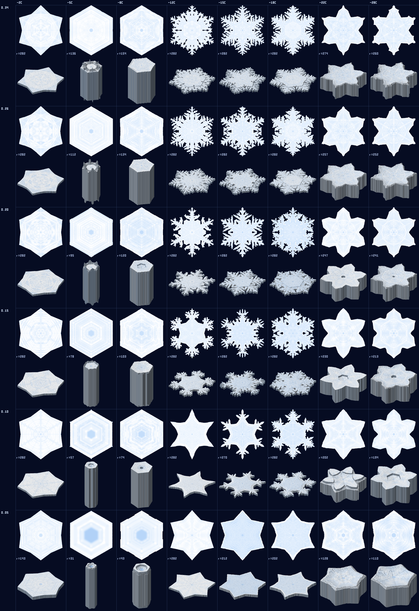
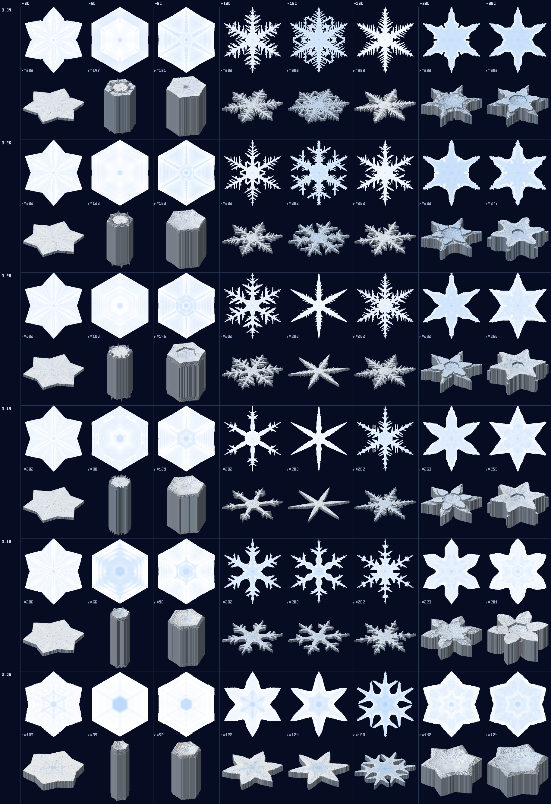

# flakesim

Grow a snow crystal from a file that describes the environment it fell
through — temperature and humidity over time — and render the result as an
SVG, a PNG, an elevated relief view and an animated GIF of the growth.

The physics is Kenneth Libbrecht's, from [snowcrystals.com](https://www.snowcrystals.com)
and his monograph [*Snow Crystals*](https://arxiv.org/abs/1910.06389): the
crystal is grown by his cellular-automaton scheme (chapter 5) with his
comprehensive attachment-kinetics model (chapter 4), in real seconds and
micrometres.  Nothing is looked up in the morphology diagram; the diagram is
what comes out.



## Quick start

```sh
cargo build --release
./target/release/flakesim run examples/01_story_flake.toml
#   → 01_story_flake.svg (final crystal), 01_story_flake.gif (growth), 01_story_flake.iso.png (relief)
./target/release/flakesim run examples/01_story_flake.toml --png flake.png --iso-gif
./target/release/flakesim info examples/01_story_flake.toml   # how the file is interpreted
./target/release/flakesim diagram --out diagram.png            # the morphology diagram, ~10 min
./target/release/flakesim diagram --cell-size-um 0.5 --out diagram.png   # 4× faster, arms without sidebranches
./run_examples.sh                                              # everything into ./out
```

## The history file

```toml
[simulation]
radius = 600                 # lattice radius in cells (0.6 mm across at 0.5 µm)
cell_size_um = 0.5           # physical cell size, µm (1 µm is 4× cheaper but loses sidebranches)
stop_molecules = 5e17        # optional: stop at this much ice instead of at the end time
growth = "poisson"           # "poisson" (stochastic nucleation) or "quantised" (deterministic, homogeneous)
nucleation_rate = 2          # poisson: nucleation of full facet sites, in fill rates (inf = deterministic)
rate_quantum = 0.05          # quantised: rates snapped to a geometric grid with steps of 1 + this
symmetric = true             # share random draws between symmetric cells (default true)
seed = 0

[output]
svg = "flake.svg"            # defaults: <history>.svg and <history>.gif in the cwd
gif = "flake.gif"
png = "flake.png"            # only written if set here or with --png
iso = "relief.png"           # elevated relief view; only written if set here or with --iso
gif_view = "top"             # "top" or "iso": which view the animation uses
iso_elevation = 35           # camera elevation above the basal plane, degrees
iso_azimuth = 20             # in-plane rotation of the crystal, degrees
iso_height_scale = 1.0       # multiplier on the physical c-axis heights
image_size = 800             # pixels (width; the relief view is shorter)
frames = 80                  # animation frames over the run
frame_delay_ms = 60
smoothing = 2                # thickness-map smoothing passes for rendering

# Keyframes, interpolated linearly in time.  Two keyframes at the same time
# make a step change.
[[history]]
time = 0                     # seconds
temperature = -15            # °C
supersaturation = 0.10       # g/m³ of water vapour above ice saturation

[[history]]
time = 600
temperature = -15
humidity = 100               # alternatively: % relative humidity over liquid water
pressure = 700               # hPa, optional (default 1013.25); interpolated like the rest
```

`supersaturation` is the excess vapour density over ice saturation in g/m³ —
the vertical axis of the morphology diagram.  `humidity` is converted with the
Murphy & Koop saturation-pressure formulas; 100 % is the "water saturation"
curve on the diagram (the humidity inside a cloud of supercooled droplets).
Sub-saturated keyframes are clamped to zero growth with a warning.
`pressure` sets the air pressure: vapour diffuses as 1/p, so the diffusion
length X₀ ∝ 1/p and growth is less diffusion-limited at altitude (§3.3).

`flakesim info` prints the interpreted history: conditions at each keyframe,
the relative supersaturation over ice, RH over water, the habit the morphology
diagram predicts, and the kinetic velocity, diffusion length, nucleation
barriers and SDAK widths in force.

## What the simulation does

The crystal lives on a hexagonal lattice of `cell_size_um` cells, seen along
the c-axis (the basal plane — what you see when a plate or stellar crystal
lies flat), as a **height map**: each ice pixel carries the crystal's
extent along the c-axis, centred on the plane.  The supersaturation field
is **three-dimensional**: the same lattice stacked in layers along the
c-axis — one cell thick next to the plane, doubling in thickness outward,
and coarsened in the plane in step with their thickness once they are
thicker than four cells — with the plane itself a mirror.  A thin plate
edge is thus fed from above and below as it is in reality, a tall prism
face is the slab it is, and the field far above the plane costs little.
Each growth step, following the book's cellular-automaton scheme
(§5.2–5.4):

1. **Field.**  The field is relaxed to its quasi-static solution
   (Laplace's equation) with the mixed boundary condition
   **X₀·∂σ/∂n = α·σ_surf** on every ice face (eq. 3.9) — prism faces at the
   edges of the height map, basal faces on top of it — with X₀ =
   D/√(kT/2πm) ≈ 0.145 µm in air (eq. 3.10).  The solver is Gauss–Seidel
   with over-relaxation, layers of one parity at a time and a 3-colouring
   of the hex lattice within them (parallel, deterministic), converged from
   scratch at the start and warm-started afterwards until the residual of
   the flux balance is below 10⁻³ everywhere.  Because the cells are wider
   than X₀, each boundary cell's value is extrapolated to the face it
   feeds; the hex finite-volume geometry is kept; a prism face takes up
   flux in proportion to the height of the edge within each layer, so a
   thin edge is the sink its height makes it whatever the cell size.  The
   outer boundary carries the crystal's own far field, σ_∞ − Q/(4πr) for
   its total uptake Q, so the box behaves like an unbounded domain and the
   crystal is fed as it would be in open air.  Unit tests grow rough
   (α = 1) crystals against exact solutions: the 2-D cylinder of §3.4 (the
   in-plane discretisation; within 11 % at 1 µm cells and 8 % at 0.5 µm)
   and a sphere in an unbounded field (the whole 3-D field; within 4 % at
   1 µm and 9 % at 0.5 µm), and check that the coarsened upper layers
   change the field near the plane by less than 0.2 %.
2. **Attachment.**  Every boundary pixel is labelled with its attachment
   coefficient — the probability that an arriving molecule sticks:
   **α = A·exp(−σ₀,eff/σ_surf)** on facet and tip sites (terrace nucleation,
   eq. 4.4), **α ≈ 1** on kink sites (§4.2), all under the same boundary
   condition, so kinks are diffusion-limited and only a few times faster
   than the facets beside them.  **σ₀,eff = σ₀·(1 − exp(−w/w₀))** lowers the
   barrier on a terrace only w µm wide (structure-dependent attachment
   kinetics, §4.3): w is the edge height, around a convex tip also the
   tip's radius of curvature, and at a corner site — the line where two
   faces meet — half a micrometre.  This is the edge-sharpening
   instability acting on corners and tips: corners sprout, tips stay
   sharp, and the sharper they are the faster they grow.  The measured
   dips sit near −14 °C on the prism facets and −4 °C on the basal facets
   (figs. 4.26–4.27) and are what selects plates or columns; σ₀(T)
   follows the step-energy behaviour of figs. 4.5–4.6 (basal rising
   towards 0 °C).  The prefactors are those of growth *in air*: background
   air lowers the attachment coefficient of a broad facet by up to two
   orders of magnitude (Libbrecht 2016 measured a hundredfold drop on the
   prism facet at −5 °C from 0.01 to 1 bar), so A_prism ≪ 1 around −5 °C
   (slender needles and columns) and A_basal ≪ 1 around −15 °C and −2 °C
   — a plate's basal faces are fed by diffusion at ~0.1 µm/s for a 30 µm
   crystal, and with the vacuum value A = 1 they would take all of it and
   make a thick plate within a minute, whereas in air a frozen droplet
   grows into a plate a few µm thin.  The reduction scales with pressure
   and vanishes as the air is pumped away.
3. **Growth.**  A pixel fills at **v = α·v_kin·(σ_surf − d₀κ)** (Hertz–
   Knudsen with the Gibbs–Thomson term, eqs. 4.1, 5.37), averaged over the
   height of the edge it extends.  κ is the in-plane curvature measured
   over a 2 µm disc (so a physical tip radius is penalised, not the
   staircase of the lattice), and a tip site feels at least the curvature
   of a tip one cell in radius, which keeps facets from roughening at the
   cell scale.  A full pixel advances the front by one hex row; the time
   step is chosen so the fastest pixel fills in two steps, so time is real
   seconds.  How a site's rate becomes an attachment is the choice of
   **growth model** (`growth` in the history file, `--growth` for the
   chart):
   * `poisson` (default): once a facet site holds a full cell of mass it
     nucleates as a Poisson process with `nucleation_rate` (in units of its
     own fill rate, so the outcome does not depend on the time step); every
     site draws independently, any number can nucleate in the same step,
     and mass that arrived while waiting stays with the cell.  The draws
     are shared between the twelve symmetric images of every cell, and so
     are the growth rates, so the crystal stays exactly symmetric while its
     sidebranching is irregular (`symmetric = false` gives independent
     arms).
   * `quantised`: no randomness.  Every site's rate is taken as a fraction
     of the fastest site's and snapped to a geometric grid with steps of
     1 + `rate_quantum` (default 0.05: the tip rate, then 1/1.05 of it,
     1/1.05², …), so every site stays within 2.5 % of its own rate whatever
     its speed, and all sites with the same quantised rate attach in
     lockstep — the six vertices of a hexagon, a whole facet row, the whole
     rim of a column.  Basal growth is quantised the same way.  Growth is
     homogeneous and exactly symmetric; as the quantum goes to zero the
     model becomes the deterministic Poisson model (`nucleation_rate =
     inf`), which a unit test checks cell for cell.  Columns come out the
     same as the baseline's at any quantum; the −15 °C dendrite at
     0.26 g/m³ is within 4 % of the baseline's mass at a quantum of 0.02,
     within 20 % at 0.1.  Stellar plates at low σ are the most sensitive:
     lockstep rows keep facets flat and layer-by-layer, where the
     baseline's staggered attachments roughen them and let them advance
     faster, so the quantised plates are more star-like.
4. **Thickness.**  New ice inherits the height of its neighbours; where the
   prism SDAK dip is deep, the edge-sharpening instability thins the new
   rim, the more the faster it advances (2 µm at rest, 1 µm at 1 µm/s —
   the feedback that makes fast tips thin and thin tips fast).  Every
   basal face grows with the same kinetics from the field cell above it,
   with the basal SDAK on the narrow terraces next to the rim — needles
   and thin-walled hollow columns come from that — and where a taller
   neighbour rises above a cell, the step's exposed prism face grows
   sideways over it, up to the step's height.  The crystal starts as a
   frozen droplet, a 10 µm disc as thick as it is wide, whose prism faces
   spread over the thin plate around it as a thick centre.

When the history changes the ambient supersaturation, the whole field is
rescaled (real vapour fields equilibrate far faster than crystals grow).
The run stops at the end of the history, when the crystal nears the lattice
edge, or at `stop_molecules`.

**Resolution.**  The book warns that Δx should be no larger than X₀
(≈0.15 µm) to resolve fine structure.  0.5 µm cells resolve the 1 µm tips
and the half-micrometre corner terraces that drive branching, and are the
default; 1 µm cells are 8× cheaper but blunt them, giving denser stellar
plates where 0.5 µm gives fernlike dendrites.  Cost grows as 1/Δx³
(cells × steps): a 250 µm-radius lattice for 200 s takes ~40 s at 1 µm
and ~5 min at 0.5 µm; the chart (48 crystals) about an hour and a half.

**Equal-mass comparison.**  `stop_molecules` (in a history) or
`diagram --molecules` ends growth once the crystal holds a given number of
water molecules (a 1 mm plate 20 µm thick is ~5e17), so habits can be
compared at the same amount of ice instead of the same time — which is how
the diagram's sketches are drawn, and which is independent of growth-rate
errors.

`flakesim diagram` grows one crystal per (T, σ) cell under constant
conditions and tiles them like the diagram (warm left, humid top), each
shown from above and, underneath, in the relief view (`--no-iso` for top
views only).  Every cell is fitted to its own crystal; `r=` is its radius in
cells after the same growth time.

## Examples

The chart covers every habit under constant conditions; the examples are
histories — conditions that change while the crystal grows, which is what
the chart cannot show.

| file | what it shows |
|---|---|
| `01_story_flake` | plate core → dendritic arms → plate-capped tips (the classic snowflake "life story") |
| `02_column_pause` | a dendrite that falls through −5 °C air, thickens along the c-axis, and resumes branching |
| `03_facet_branch_cycles` | alternating humid/dry air: plates part-way along each arm |

The examples grow 1 mm crystals at the default 0.5 µm cells (roughly an
hour each with the 3-D field).  `./run_examples.sh` renders them all plus the chart into
`out/`.

## In the browser

The simulator compiles to WebAssembly (`wasm-pack build --target web
--no-default-features --features wasm`; the growth loops fall back to
sequential iteration, since static hosts cannot serve the headers threaded
wasm needs).  `web/` is a static page that grows a crystal live in a Web
Worker from any history file, with presets, and shows both charts.  A
200 s dendrite at 2 µm cells takes about half a minute in the browser, at
1 µm a minute or two; 0.5 µm is offered but slow single-threaded.

`.github/workflows/pages.yml` tests the native build, builds the wasm
package, adds the chart images from `docs/`, and deploys `web/` to GitHub
Pages on every push to `main` or `master` (enable Pages with "GitHub Actions" as the
source under the repository's Settings → Pages).  To try it locally:

```sh
wasm-pack build --target web --release --out-dir web/pkg --no-default-features --features wasm
mkdir -p web/docs && cp docs/*.png web/docs/
python3 -m http.server -d web 8000     # then open http://localhost:8000/
```

## Outputs

* **SVG** — the crystal as nested thickness bands, each traced as the outline
  of the cells above a mass threshold, in integer lattice units with a group
  transform (so large crystals stay well under a few MB).
* **GIF** — the growth animation, all frames at the final crystal's scale,
  top-down or in the relief view (`gif_view = "iso"` / `--iso-gif`).
* **PNG** — the final crystal, supersampled.
* **Relief view** (`--iso`) — every cell extruded into a hexagonal prism of
  its c-axis height, centred on the basal plane, drawn with an orthographic
  camera raised above the plane and lit from the upper left.  Plates come out
  thin with their ridges, columns and needles tall, hollow columns cupped.
  `iso_height_scale` exaggerates the heights if wanted.


The same chart grown with the quantised model (`flakesim diagram --growth
quantised`): homogeneous prism faces, flat or cupped column tops, exactly
symmetric arms, thinner and more regular than the Poisson model's.



## Limitations

* The lattice is coarser than the book's Δx ≲ X₀ prescription; the
  boundary condition needs the extrapolation described above to stay
  accurate at Δx ≫ X₀, and the morphology still depends on the cell size
  (1 µm cells branch less than 0.5 µm).  The field layers double in
  thickness and coarsen away from the plane, so the basal faces of tall
  columns are fed from coarse cells.
* The in-air prefactors A(T) (especially the basal one around −15 °C) are
  set to reproduce the morphology diagram, not measured.
* The crystal is a height map: one c-axis extent per basal-plane cell,
  centred on the plane.  Columns, needles, plates and hollow ends are
  represented; a capped column (thin plates at *both ends* of a column) or a
  bullet rosette is not — a plate phase after a column phase widens the
  column instead.
* σ₀(T), A(T) and the SDAK widths are a reconstruction of the book's
  figures 4.5–4.6 and 4.26–4.27 (the numbers are only in its plots).
* Sublimation in sub-saturated air is not modelled.
